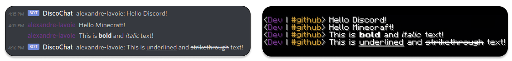

<center><h2>DiscoChat</h2></center>

<center></center>

<center><a href="https://github.com/Concordia-Modding-Community/discochat/releases"></a>
<a href="https://github.com/Concordia-Modding-Community/discochat/releases"></a>
<a href="https://github.com/Concordia-Modding-Community/discochat/blob/main/LICENSE"></a>
<a href="https://github.com/Concordia-Modding-Community/discochat/actions/workflows/gradle.yml"></a></center>

<br/>

## Table of Contents

- [Overview](#overview)
- [Features](#features)
- [Getting Started](#getting-started)
    - [Discord Server](#discord-server)
    - [Discord Bot](#discord-bot)
    - [Minecraft Server](#minecraft-server)
    - [Linking](#linking)
- [Configuration](#configuration)
- [Development](#development)
- [Acknowledgments](#acknowledgments)

## Overview

DiscoChat is a Minecraft-Discord Integration for Minecraft Forge. It is inspired by other MC-Discord Integrations like [Discord Integration](https://www.curseforge.com/minecraft/mc-mods/dcintegration) and [DiscordIntegration](https://www.curseforge.com/minecraft/mc-mods/discordintegration). This mod aims to offer more robust features to have a more Discord-like experience in Minecraft.

## Features

A few things that make DiscoChat great:

- Bidirectional communication between Minecraft and Discord.
- Streamlined account linking and permissions.
- Channel based communication in Minecraft.
- Highly configurable through TOML.
- Server-side only.

## Getting Started

This sections covers all the required components to run DiscoChat.

### Discord Server

If you do not already have a Discord Server, you will need to create one. You can follow these instructions to setup your server: https://support.discord.com/hc/en-us/articles/204849977-How-do-I-create-a-server-. 

### Discord Bot

You will need to setup a Discord Bot for your Discord/Minecraft server. Each server should use it's own Discord Bot. You can follow these instructions for setting up your bot: https://discordpy.readthedocs.io/en/latest/discord.html. Add the new Discord Bot to your Discord Server as Administrator (8). Don't forget to activate the `Privileged Gateway Intents`.

### Minecraft Server

You will need a Minecraft Forge server for 1.16.X. You can find installs here: http://files.minecraftforge.net/maven/net/minecraftforge/forge. You can also buy a Minecraft Forge Server host (there are many options). Once you have a Minecraft Server, you will need to put a release for this mod in the server `/mod` folder. Releases can be found [here](https://github.com/Concordia-Modding-Community/discochat/releases).

### Linking

You will need to either enter the Minecraft world as admin or run commands through the server pannel. If you enter in-game, a menu will appear in chat giving you instructions for linking. You can also just simply run the following command:

```minecraft
/discord token BOT_TOKEN
```

If everything was done correctly, DiscoChat should be fully installed!

## Configuration

DiscoChat provides a variety of configuration in as a TOML file. This file can be found in your Minecraft Server under `/saves/**/serverconfig/discochat-server.toml`. The file has comments describing what each field modifies. This includes the API key, message formatting, and other useful configuration. It is recommended that you have a look and configure according to your needs.

## Commands

By default, Discord commands are prefixed by `!` and Minecraft commands by `/discord`. This can modified in the configuration TOML. A list of commands is provided through the `help` command. Following is a list of each commands:

```
help -> List all commands with their fields. (Both)

link ... -> Links this account to other account. If on MC, links to Discord and vice-versa. (Both)

listen <Channel> -> Starts listening to a channel. (MC only)

msg <Channel> <Message> -> Messages a specific channel without switching (MC only).

start -> Starts the Discord Bot. (MC only)

stop -> Stops the Discord Bot. (MC only)

switch <Channel> -> Switches to a specific channel. Use none to use the in-game chat. (MC only)

token <Bot-Token> -> Links Minecraft Server to Discord Bot using token. (MC only)

unlink -> Removes this user from DiscoChat. This serves as unregistration. (Both)

verify -> Verifies the link request sent from other account. (Both)
```

## Development

Development for DiscoChat works almost the same as other Forge mods. You can get started developing using the following commands (assuming you are using the VSCode editor). Each editor has it's own `gen...Runs` which can be found online.

```bash
git clone https://github.com/Concordia-Modding-Community/discochat
git submodule update --init --recursive --remote
./gradlew genVsCodeRuns
```

## Acknowledgments

We want to thank the Concordia University Part-time Faculty Association for the Professional Development Grant that allows us to develop/contribute to the open source community. 